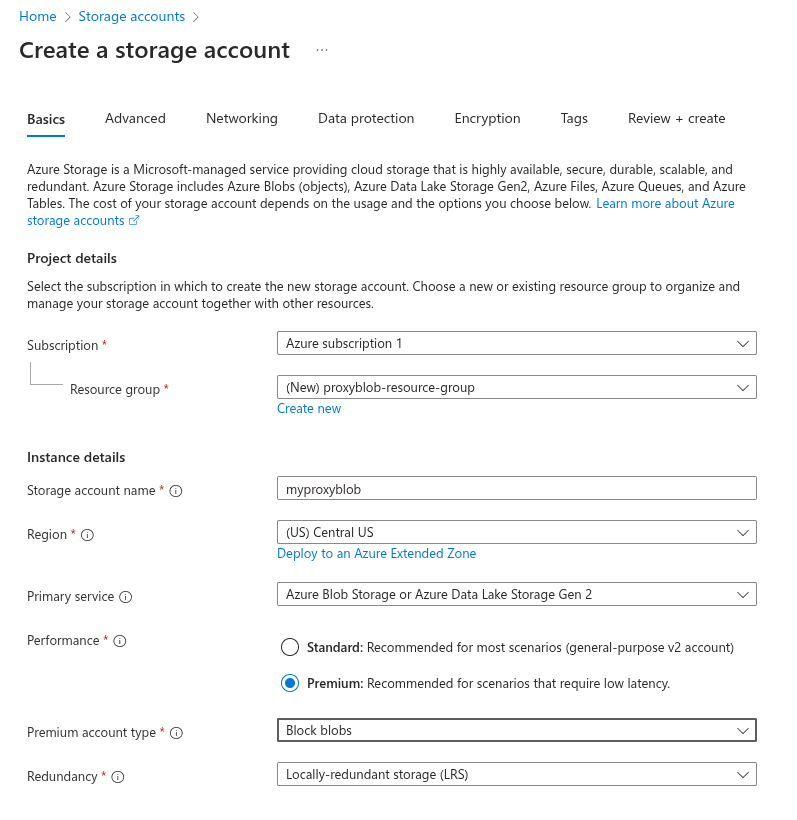
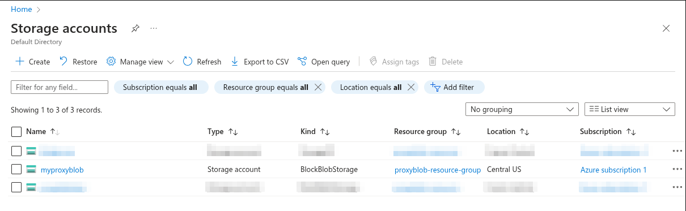
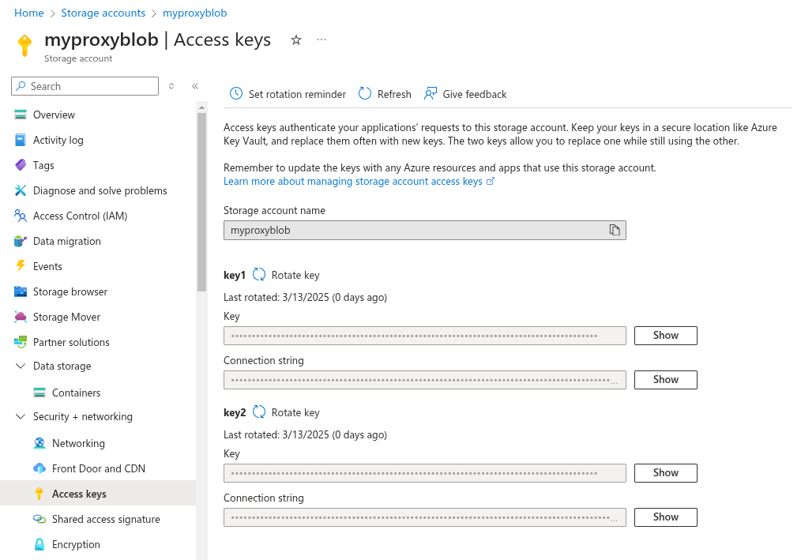
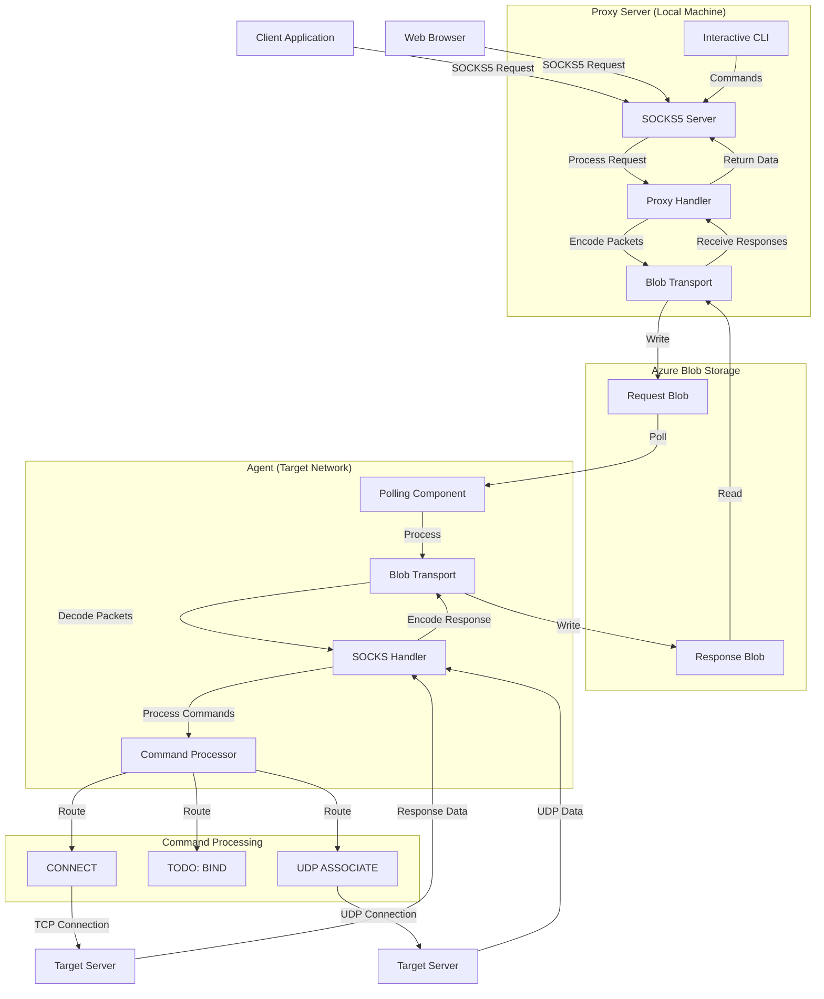
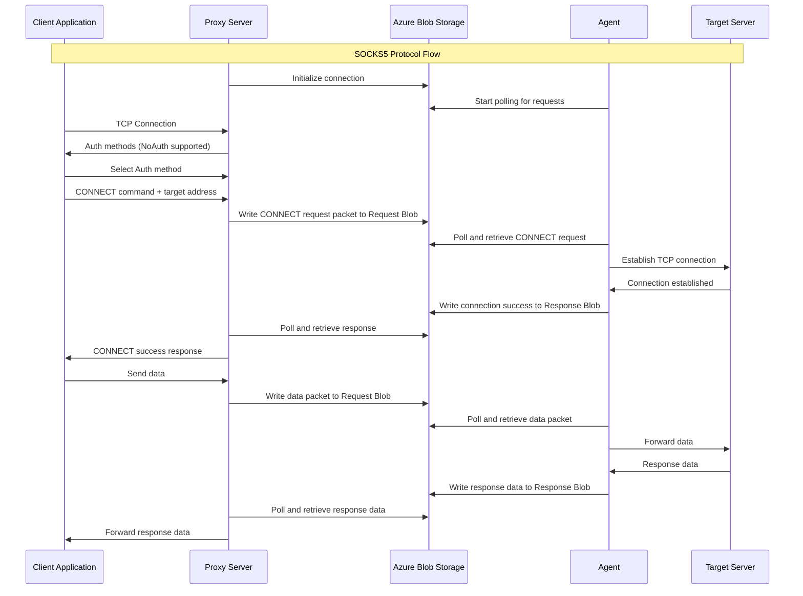

# ProxyBlob

<p align="center">
  
</p>
<p align="center"><i>SOCKS proxy over Azure Storage Blob service</i></p>

## Overview

ProxyBlob is a tool designed to create SOCKS proxy tunnels through Azure Blob Storage service. This is particularly useful in environments where direct network connectivity is restricted but `*.blob.core.windows.net` is accessible.

The system consists of two components:

1. **Proxy Server**: Runs on your local machine and provides a SOCKS interface for your applications
2. **Agent**: Runs inside the target network and communicates with the proxy through Azure Blob Storage

## Features

- SOCKS5 protocol (CONNECT and UDP ASSOCIATE)
- Communication through Azure Blob Storage
- Interactive CLI with auto-completion
- Multiple agent management
- Local proxy server

## Prerequisites

- Go 1.23 or higher
- An Azure Storage Account

### Storage Account

#### Azure

In order to use ProxyBlob, you will need an Azure Subscription to create an Azure Storage Account. Once you have a subscription, you can create a storage account in the Azure Portal or using the Azure CLI.

Here are the steps to create a storage account using the Azure Portal:

1. Go to [https://portal.azure.com](https://portal.azure.com)
2. Login with your Azure account
3. In the top Search bar, type "Storage accounts"
4. Click on "+ Create"
5. Fill in the required fields
6. Click on "Review + create"
7. Click on "Create"

Storage account settings:

- **Subscription**: Select your Azure subscription
- **Resource Group**: Create new Resource Group or select existing
- **Storage account name**: Choose a name for your storage account
- **Location**: Select a location near you
- **Performance**: Premium ⚠️ we will require low latency and high throughput
- **Premium account type**: Block blobs (high transaction rates)
- **Redundancy**: Locally-redundant Storage (LRS)

<p align="center">
  
</p>


Once the deployment is complete, you will see the newly created storage account in the list.

<p align="center">
  
</p>

Finally, click on "Security + networking" and then "Access keys" to get the storage account key.

<p align="center">
  
</p>

Here are the steps to create a storage account using the Azure CLI:

```bash
# Login to Azure
az login

# Create a resource group
az group create --name "proxyblob-resource-group" --location "Central US"

# Create a storage account
az storage account create --name "myproxyblob" --resource-group "proxyblob-resource-group" --location "Central US" --sku "Premium_LRS" --kind BlockBlobStorage

# Get the storage account key
az storage account keys list --account-name "myproxyblob" --output table
```

You should see displayed the storage account keys.

#### Azurite

If you want to test the tool, you can also use [Azurite](https://github.com/Azure/Azurite), a lightweight server clone of Azure Storage that can be run locally. To install Azurite, I recommend using either [Visual Studio Code extension](https://marketplace.visualstudio.com/items?itemName=Azurite.azurite) or [Docker](https://hub.docker.com/r/microsoft/azure-storage-azurite).

For the extension, installation is straightforward:

1. Go to the Extensions tab
2. Search for `Azurite.azurite`
3. Click "Install"

You should see down right of your editor 3 buttons like this:

```
[Azurite Table Service] [Azurie Queue Service] [Azurite Blob Service]
```

Press on the `[Azurite Blob Service]` and the service should be running.

For Docker, you will have to pull the image and run it:

```
docker pull mcr.microsoft.com/azure-storage/azurite
docker run -p 10000:10000 mcr.microsoft.com/azure-storage/azurite
```

The default storage account name is `devstoreaccount1` and the account key is `Eby8vdM02xNOcqFlqUwJPLlmEtlCDXJ1OUzFT50uSRZ6IFsuFq2UVErCz4I6tq/K1SZFPTOtr/KBHBeksoGMGw==`.

## Installation

```bash
# Clone the repository
git clone https://github.com/quarkslab/proxyblob
cd proxyblob

# Build both components
make
```

This will produce the following binaries:

- `proxy` - the proxy server running on your machine
- `agent` - the agent running on the target

## Configuration

Create a `config.json` file based on the [example](example_config.json) with your Azure Storage credentials:

```json
{
  "storage_url": "http://localhost:10000/", // omit if using Azure
  "storage_account_name": "your-storage-account-name",
  "storage_account_key": "your-storage-account-key"
}
```

## Usage

### Starting the Proxy Server

```bash
./proxy -c my-config.json # if omitted, config.json is used by default
```

This will start an interactive CLI with the following commands:

```
Commands:
  clear         clear the screen
  create, new   create a new agent container and generate its connection string
  delete, rm    delete an existing agent container
  exit          exit the shell
  help          use 'help [command]' for command help
  list, ls      list all existing agent containers
  select, use   select an agent for subsequent commands
  start, proxy  start SOCKS proxy server
  stop          stop running proxy for the selected agent
```

Once the proxy server is running, you can create a new agent container by using the `create` command.

```
proxyblob » create
16:28:37 INF Agent container created successfully container_id=5f5250e9-5518-4682-90ea-f61abf797654
16:28:37 INF Connection string generated connection_string=aHR0cDovL2xvY2FsaG9zdDoxMDAwMC9kZXZzdG9yZWFjY291bnQxLzVmNTI1MGU5LTU1MTgtNDY4Mi05MGVhLWY2MWFiZjc5NzY1ND9zZT0yMDI1LTA0LTI0VDE0JTNBMjglM0EzN1omc2lnPXpjNUNVYVZKJTJGS1duY3RtbnlNZ0clMkZZNkNrRzZHYXJzMXRFTXkxR0ZiTVVZJTNEJnNwPXJ3JnNwcj1odHRwcyUyQ2h0dHAmc3I9YyZzdD0yMDI1LTA0LTE3VDE0JTNBMjMlM0EzN1omc3Y9MjAyMC0xMC0wMg
```

Use the connection string generated with the agent (see below [Starting the Agent](#starting-the-agent)). If the agent connects successfully, you should see the “Agent Info” column filled in when you list the agents with the `list` command.

```
proxyblob » list
╭──────────────────────────────────────┬────────────┬────────────┬─────────────────────┬─────────────────────╮
│ CONTAINER ID                         │ AGENT INFO │ PROXY PORT │ FIRST SEEN          │ LAST SEEN           │
├──────────────────────────────────────┼────────────┼────────────┼─────────────────────┼─────────────────────┤
│ 5f5250e9-5518-4682-90ea-f61abf797654 │ atsika@qb  │            │ 2025-04-17 14:28:37 │ 2025-04-17 14:28:37 │
╰──────────────────────────────────────┴────────────┴────────────┴─────────────────────┴─────────────────────╯
```

Select the agent using `select <container id>` and start the proxy listener (by default it listens on localhost:1080) by using the `start` command. 

```
atsika@qb » select 5f5250e9-5518-4682-90ea-f61abf797654
17:17:51 INF Agent selected agent=atsika@qb
atsika@qb » start
17:17:58 INF Proxy started successfully agent=atsika@qb port=1080
```

You can now use for example [proxychains](https://github.com/rofl0r/proxychains-ng) to tunnel the traffic through the SOCKS proxy.

```bash
proxychains xfreerdp /v:dc01.domain.local /u:Administrator
```

### Starting the Agent

In order to run, the agent requires a connection string that can be generated using the proxy. You can pass it as an argument or directly embed it at compile-time.

```bash
# Via argument
./agent -c <generated-connection-string>

# Build the agent with embedded connection string
make agent TOKEN=<generated-connection-string>
./agent
```

## Architecture

The communication flow works like this:

1. The agent periodically polls an Azure Blob container for encoded packets in a request blob
2. The proxy writes encoded packets to the Azure Blob container in a request blob
3. When the agent finds a packet, it processes it and writes the response back to a response blob
4. The proxy reads the response and maintains the SOCKS connection with client applications

The global flow is the following:



An example of a CONNECT operation is the following:



## Troubleshooting

**Why does my agent immediately stop running ?**

There might be several reasons why your agent stops immediately after you run it. Check its exit code:
```sh
# Bash
echo $?
```
```cmd
REM CMD
echo %ERRORLEVEL%
```
```pwsh
# PowerShell
echo $LastExitCode
```

Each exit code describes why the agent stopped running:

| Exit code | Reason                                      |
| --------- | ------------------------------------------- |
| 0         | No error                                    |
| 1         | The context has been canceled               |
| 2         | The connection string is missing            |
| 3         | The connection string is invalid or expired |
| 4         | The agent failed to write its metadata      |
| 5         | The agent container is not found            |

If you encounter issues:

1. Check Azure credentials and permissions
2. Verify connectivity to Azure Blob Storage
3. Check for any firewall rules blocking outbound connections
4. Ensure the agent is running and properly connected

## TODO

- BIND command implementation (currently not working)
- Enhanced error handling and recovery
- Improve proxy speed

## License

[GNU GPLv3 License](LICENSE)